# 🌊 SafeFlow

<div align="center">


**🤖 Intelligent Code Agent Framework for Software Engineering**

[](https://www.python.org)
[](https://openai.com)
[](https://github.com/psf/black)

*Autonomous code generation, debugging, and software engineering with advanced memory management*

[🚀 Quick Start](#-quick-start) •
[📖 Documentation](#-documentation) •
[🛠️ Features](#-features) •
[🏗️ Architecture](#-architecture) •
[🤝 Contributing](#-contributing)

</div>

---

## 🎯 What is SafeFlow?

SafeFlow is a cutting-edge **AI-powered code agent framework** designed for autonomous software engineering tasks. It combines the power of large language models with sophisticated tool orchestration, intelligent memory management, and precise code manipulation capabilities.

### 🌟 **Key Highlights**

- 🧠 **Smart Memory Management** - Intelligent conversation summarization and context preservation
- 🔧 **Modular Tool System** - Specialized tools for editing, searching, testing, and planning
- 🎯 **SWE-Bench Ready** - Built for software engineering benchmarks and real-world tasks
- 🚀 **Advanced Agent Architecture** - Dual-agent system with specialized responsibilities
- 📊 **Comprehensive Tracing** - Full observability and reproducibility

---

## ✨ Features

<table>
<tr>
<td width="50%">

### 🧠 **Intelligent Memory System**
- **LLM-Powered Summarization** - Context-aware conversation compression
- **Token Management** - Automatic optimization for long conversations
- **Plan Persistence** - Maintains task context across sessions
- **Selective Retention** - Preserves critical information while optimizing performance

</td>
<td width="50%">

### 🛠️ **Advanced Tool Orchestra**
- **Windowed Editor** - Precise line-by-line code editing with syntax awareness
- **AST Symbol Search** - Intelligent symbol resolution and reference tracking
- **Environment Management** - Safe command execution with timeout handling
- **Semantic Code Search** - AI-powered code understanding and discovery

</td>
</tr>
<tr>
<td width="50%">

### 🎯 **Production Ready**
- **SWE-Bench Integration** - Ready for software engineering benchmarks
- **Repository Cloning** - Automatic project setup and initialization
- **Test Execution** - Comprehensive testing and validation workflows
- **Quality Assurance** - Built-in linting, formatting, and code review

</td>
<td width="50%">

### 🚀 **Enterprise Grade**
- **Modular Architecture** - Clean separation of concerns and extensibility
- **Comprehensive Logging** - Full traceability for debugging and analysis
- **Error Recovery** - Robust error handling and rollback mechanisms
- **Multi-Language Support** - Python, JavaScript, TypeScript, Go, Java, C++

</td>
</tr>
</table>

---

## 🏗️ Architecture

```mermaid
flowchart TB
    subgraph "🎭 Agent Layer"
        DA[🤖 DefaultAgent<br/>Main Executor]
        CM[🧠 ContextManagerAgent<br/>Memory & State]
    end

    subgraph "🛠️ Tool Registry"
        TR[📋 Tool Registry<br/>Dynamic Routing]

        subgraph "Core Tools"
            BT[🔧 Base Tools<br/>Git & Setup]
            WE[✏️ Windowed Editor<br/>Code Editing]
            FS[🗂️ File System<br/>Discovery & Search]
            EM[⚡ Environment<br/>Execution & Testing]
            PT[📝 Planning<br/>Task Management]
        end
    end

    subgraph "💾 Persistence Layer"
        TT[📊 Trace Track<br/>Event Logging]
        MS[📄 Message Store<br/>Conversation History]
        PS[📋 Plan Storage<br/>Task Context]
    end

    subgraph "🌐 External Systems"
        LLM[🧠 Language Models<br/>GPT-4, Claude, etc.]
        GIT[📦 Git Repositories<br/>Source Control]
        SYS[💻 System<br/>Commands & Tests]
    end

    DA --> CM
    DA --> TR
    TR --> BT & WE & FS & EM & PT

    DA --> TT
    CM --> MS & PS

    BT --> GIT
    EM --> SYS
    DA --> LLM
    CM --> LLM

    style DA fill:#e1f5fe
    style CM fill:#f3e5f5
    style TR fill:#fff3e0
    style TT fill:#e8f5e8
```

<div align="center">



</div>

### 🔧 **Tool Responsibilities**

| Tool | Primary Function | Capabilities |
|------|------------------|-------------|
| 🔧 **Base Tools** | Initialization & Git | Workspace setup, repository cloning, task completion |
| ✏️ **Windowed Editor** | Code Editing | Line-precise editing, file info, syntax-aware modifications |
| 🗂️ **File System** | Discovery & Analysis | File search, semantic search, AST symbol resolution |
| ⚡ **Environment** | Execution & Testing | Command execution, testing, quality checks |
| 📝 **Planning** | Task Management | Plan creation, progress tracking, milestone management |

---

## 🚀 Quick Start

### Prerequisites

```bash
# Ensure Python 3.10+ is installed
python --version  # Should be 3.10 or higher
```

### Installation

<details>
<summary><b>🐍 Option 1: Using Conda (Recommended)</b></summary>

```bash
# Clone the repository
git clone git@github.com:Yunhao-Feng/SafeFlow.git
cd safeflow

# Create and activate conda environment
conda env create -f environment.yml
conda activate safe

# Verify installation
python -c "import openai, anthropic, rich; print('✅ All dependencies installed')"
```

</details>

<details>
<summary><b>🔧 Option 2: Using pip</b></summary>

```bash
# Clone the repository
git clone git@github.com:Yunhao-Feng/SafeFlow.git
cd safeflow

# Create virtual environment
python -m venv venv
source venv/bin/activate  # On Windows: venv\Scripts\activate

# Install core dependencies
pip install -r requirements.txt

# Install optional ML dependencies for semantic search
pip install sentence-transformers torch transformers
```

</details>

### Configuration

Create your configuration file:

```yaml
# config/default.yaml
api_url: "https://api.openai.com/v1"
api_key: "your-openai-api-key"  # or set OPENAI_API_KEY env var
model_name: "gpt-4"
output_dir: "./outputs"
max_turns: 100

# Memory management
token_threshold: 100000
plan_reminder_threshold: 30

# Tool settings
default_timeout: 30
max_file_size: 2097152
```

### First Run

```bash
# Basic usage
python run.py

# With custom config
APP_CONFIG="config/custom.yaml" python run.py

# Interactive mode with rich output
python run.py --interactive

# SWE-bench evaluation
python test.py --dataset swe_bench_verified
```

---

## 💡 Usage Examples

### 🔧 **Autonomous Code Generation**

```python
# Natural language to code
"Create a FastAPI endpoint for user authentication with JWT tokens"
"Implement a binary search tree with insertion, deletion, and traversal methods"
"Add comprehensive error handling to the database connection module"
"Refactor this class to use the factory pattern"
```

### 🔍 **Intelligent Code Analysis**

```python
# Semantic code understanding
"Find all functions that handle file I/O operations"
"Show me where the authentication logic is implemented"
"Locate all classes that inherit from BaseModel and their usage patterns"
"Analyze the performance bottlenecks in this codebase"
```

### 🧪 **Automated Testing & Quality**

```python
# Complete test workflows
"Run the entire test suite and fix any failing tests"
"Generate comprehensive unit tests for the new payment module"
"Perform code quality analysis and fix all linting issues"
"Add integration tests for the API endpoints"
```

### 📊 **Project Analysis & Refactoring**

```python
# Large-scale code operations
"Analyze this legacy codebase and suggest modernization strategies"
"Migrate from SQLAlchemy 1.x to 2.x across the entire project"
"Implement proper logging throughout the application"
"Add type hints to all functions and classes"
```

---

## 🔍 Advanced Features

### 🧠 **Smart Memory Management**

SafeFlow's memory system intelligently manages conversation context:

```python
# Automatic context optimization
- Monitors token usage in real-time
- Applies LLM-powered summarization when needed
- Preserves critical context (recent messages + key decisions)
- Maintains plan continuity across long sessions
```

### 🎯 **AST-Level Code Understanding**

Advanced symbol resolution and code analysis:

```python
# Precise symbol search
symbol_search(
    symbol_name="UserService",
    symbol_type="class",
    search_type="definition"  # or "reference", "usage", "all"
)

# Results include:
- Exact definition location with line numbers
- All references and their contexts
- Usage patterns and call graphs
- Confidence scores for each match
```

### 📊 **Comprehensive Observability**

Every operation is fully traceable:

```json
{
  "timestamp": "2024-01-18T10:30:00Z",
  "agent": "default",
  "action": "tool_call",
  "tool": "windowed_editor",
  "function": "edit_lines",
  "parameters": {...},
  "result": {...},
  "success": true,
  "token_usage": {
    "prompt_tokens": 2048,
    "completion_tokens": 512,
    "total_tokens": 2560
  }
}
```

---

## 🧪 Testing & Evaluation

### Unit Testing

```bash
# Run all tests
python -m pytest test/ -v

# Test specific components
python -m pytest test/test_memory_management.py
python -m pytest test/test_tool_system.py
python -m pytest test/test_agent_coordination.py

# Coverage report
python -m pytest --cov=safeflow --cov-report=html
```

### SWE-Bench Evaluation

```bash
# Load and run SWE-bench verified dataset
python test.py --dataset swe_bench_verified --max_instances 50

# Run specific instance
python test.py --instance django__django-11039

# Evaluate with different models
python test.py --model gpt-4o --temperature 0.2
```

### Performance Benchmarks

```bash
# Memory usage profiling
python benchmark/memory_profile.py

# Tool execution timing
python benchmark/tool_performance.py

# End-to-end task timing
python benchmark/e2e_benchmark.py
```

---

## 🛠️ Development

### Development Setup

```bash
# Clone and setup development environment
git clone git@github.com:Yunhao-Feng/SafeFlow.git
cd safeflow

# Install in development mode with all extras
conda env create -f environment.yml
conda activate safe

# Install pre-commit hooks
pip install pre-commit
pre-commit install

# Run quality checks
black .
flake8 . --max-line-length=100
mypy safeflow/
```

### Adding New Tools

```python
# 1. Create tool class
class MyCustomTool(Tool):
    @tool_function(
        description="My custom functionality",
        parameters=[
            ToolParameter("input", "string", "Input data", required=True)
        ]
    )
    def my_function(self, input: str) -> Dict[str, Any]:
        # Implementation here
        return {"success": True, "result": "processed"}

# 2. Register in DefaultAgent
self.tool_registry.register_tool(MyCustomTool(item_id=item_id))
```

### Extending Agent Capabilities

```python
# Custom agent with specialized behavior
class SpecializedAgent(DefaultAgent):
    def __init__(self, config, **kwargs):
        super().__init__(config, **kwargs)
        # Add specialized tools or modify behavior

    def custom_workflow(self, task: str):
        # Implement specialized task handling
        pass
```

---

## 📋 Configuration Reference

<details>
<summary><b>📖 Complete Configuration Options</b></summary>

```yaml
# API Configuration
api_url: "https://api.openai.com/v1"
api_key: "sk-..."
model_name: "gpt-4"

# Agent Settings
max_turns: 100
output_dir: "./outputs"

# Memory Management
token_threshold: 100000      # When to trigger summarization
plan_reminder_threshold: 30  # Turns before plan reminder

# Tool Configuration
default_timeout: 30          # Command timeout (seconds)
max_file_size: 2097152      # Max file size for processing (2MB)

# Tracing & Logging
enable_tracing: true
trace_level: "INFO"         # DEBUG, INFO, WARNING, ERROR
save_artifacts: true

# Security Settings
allow_network: false        # Restrict network access
sandbox_mode: true          # Enable sandboxed execution
allowed_commands:           # Whitelist specific commands
  - "python"
  - "pip"
  - "git"

# Performance Tuning
parallel_tools: true        # Enable parallel tool execution
cache_responses: true       # Cache LLM responses
batch_size: 10             # Batch processing size
```

</details>

---

## 🤝 Contributing

We welcome contributions from the community! Here's how you can help:

### 🚀 **Ways to Contribute**

- 🐛 **Report bugs** - Found an issue? Let us know!
- 💡 **Suggest features** - Have ideas for improvements?
- 🔧 **Submit PRs** - Code contributions are always welcome
- 📖 **Improve docs** - Help make our documentation better
- 🧪 **Add tests** - Help improve code coverage and reliability

### 📋 **Development Workflow**

1. **Fork** the repository
2. **Create** a feature branch (`git checkout -b feature/amazing-feature`)
3. **Make** your changes with tests
4. **Run** quality checks (`black .`, `flake8 .`, `pytest`)
5. **Commit** your changes (`git commit -m 'Add amazing feature'`)
6. **Push** to your fork (`git push origin feature/amazing-feature`)
7. **Open** a Pull Request

### 🎯 **Current Priorities**

- [ ] 🌍 **Multi-language support** (JavaScript, Go, Rust)
- [ ] 🔗 **IDE integrations** (VS Code, JetBrains)
- [ ] ⚡ **Performance optimizations** (caching, parallelization)
- [ ] 🛡️ **Enhanced security** (sandboxing, permissions)
- [ ] 📊 **Advanced analytics** (usage metrics, success rates)

---

## 📊 Benchmarks & Results

<div align="center">

### 🏆 **SWE-Bench Performance**


### ⚡ **Performance Metrics**


</div>

---

## 📄 License & Acknowledgments

<div align="center">

### 📜 **License**

This project is licensed under the **Apache2.0 License** - see the [LICENSE](LICENSE) file for details.

### 🙏 **Acknowledgments**

- **OpenAI** for providing the GPT models that power our agents
- **Anthropic** for Claude models and AI safety research
- **SWE-bench** team for creating the evaluation framework
- **Hugging Face** for transformers and model hosting
- **Our amazing contributors** who make this project possible

### 🌟 **Special Thanks**

Built with ❤️ by developers, for developers. Inspired by the vision of AI-assisted software engineering and the open-source community.

---

*Making software engineering more intelligent, one commit at a time* 🌊

</div>